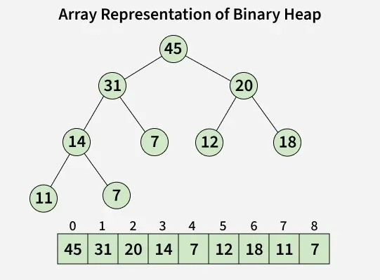

#+TITLE: Priority Queues and Applications
#+AUTHOR: Serob Tigranyan

\newpage

* Introduction
A *Priority Queue* is an abstract data type that operates similarly to a regular queue or stack, but where every element has an associated "priority." In a priority queue, an element with high priority is served before an element with low priority.

** Implementation: The Binary Heap
In computer science, a priority queue is most efficiently implemented using a *Binary Heap*.

*** What is a Binary Heap?
A Binary Heap is a complete binary tree that satisfies the *heap property*:
- *Max-Heap:* The value of each node is less than or equal to the value of its parent. The largest element is at the root.
- *Min-Heap:* The value of each node is greater than or equal to the value of its parent. The smallest element is at the root.

*** Array-Based Implementation
Because a heap is a *complete* binary tree (all levels are filled except possibly the last, which is filled from left to right), it can be stored compactly in a contiguous array without pointers.

For an element at index =i=:
- *Left Child:* =2i + 1=
- *Right Child:* =2i + 2=
- *Parent:* =(i - 1) / 2=

This layout allows for $O(1)$ access to the top element and $O(\log n)$ time for both insertion and deletion by "bubbling" or "sifting" elements up or down to restore the heap property.

\newpage

* C++ Support for Priority Queues
C++ provides built-in support for priority queues through the Standard Template Library (STL).

** The =std::priority_queue= Container
Found in the =<queue>= header, =std::priority_queue= is a container adaptor. It provides $O(\log n)$ insertion and extraction, and $O(1)$ access to the top element.

Basic usage of =std::priority_queue=:
#+BEGIN_SRC cpp
#include <iostream>
#include <queue>

int main() {
    // Default: Max heap
    std::priority_queue<int> max_queue;
    // Min heap
    std::priority_queue<
        int, 
        std::vector<int>, 
        std::greater<int>> min_queue;

    for (const int e : { 45, 31, 20, 14, 7, 12, 18, 11, 7, }) {
        max_queue.push(e);
        min_queue.push(e);
    }

    std::cout << "max: ";
    while (!max_queue.empty()) {
        std::cout << max_queue.top() << " ";
        max_queue.pop();
    }
    std::cout << std::endl;
    
    std::cout << "min: ";
    while (!min_queue.empty()) {
        std::cout << min_queue.top() << " ";
        min_queue.pop();
    }
    std::cout << std::endl;

    return 0;
}
#+END_SRC

Which yields the following output:
#+BEGIN_SRC bash
endrohu@noedarlin:/tmp $ c++ -std=c++20 prio_queue.cpp -o queue && ./queue 
max: 45 31 20 18 14 12 11 7 7 
min: 7 7 11 12 14 18 20 31 45
#+END_SRC

** Key Properties
- *Underlying Container:* Defaults to =std::vector=, but can use =std::deque=.
- *Ordering:* By default, it uses =std::less<T>=, making it a *Max-Heap*.
- *No Iterator Support:* Unlike =std::vector= or =std::list=, you cannot iterate through a priority queue. You can only access the =top()= element.

  \newpage
* Technical Challenges: The "Decrease Key" Problem
Standard =std::priority_queue= does *not* support updating the priority of an element already in the queue.

** Solutions:
1. *Lazy Removal:* Instead of updating, push a new entry with the better cost. When popping, check if the node has already been processed with a lower cost; if so, skip it.
2. *std::make_heap:* Use a raw =std::vector= with =std::push_heap= and =std::pop_heap=, which allows manual searching or using a custom indexed heap.

\newpage
* Example Code: Custom Priority Handling
#+BEGIN_SRC cpp
#include <iostream>
#include <queue>
#include <vector>

struct RenderBatch {
    int id;
    int z_index;

    // Min-Heap based on z_index
    bool operator>(const RenderBatch& other) const {
        return z_index > other.z_index;
    }
};

int main() {
    std::priority_queue<RenderBatch,
                        std::vector<RenderBatch>,
                        std::greater<RenderBatch>> draw_queue;

    draw_queue.push({1, 100}); // UI
    draw_queue.push({2, 0});   // Background
    draw_queue.push({3, 50});  // Player

    while (!draw_queue.empty()) {
        RenderBatch batch = draw_queue.top();
        std::cout << "Rendering Batch ID: " << batch.id
                  << " (Z-Index: " << batch.z_index
                  << ")" << std::endl;
        draw_queue.pop();
    }

    return 0;
}
#+END_SRC

* Applications
As a game engine developer, I personally have used priorities queues in the past so I will demonstrate few of its applications in engine development.
Priority queues are vital in game development for managing asynchronous tasks and ensuring deterministic ordering.

** 1. Abstracted Render Command Queues
Modern APIs like Vulkan and DirectX 12 have native *CommandQueues*. OpenGL, however, is notoriously single-threaded: its context can only be active on one thread at a time.
- *The Problem:* How do we allow other threads (AI, Physics, Editor) to "call" OpenGL functions?
- *The Solution:* We imitate a Command Queue.
  - *Abstraction:* Create a =GLCommandQueue= class.
  - *Submission:* Worker threads call =gl_submit_command= to push commands (e.g., =DrawMeshCommand=, =UpdateUniformCommand=) to a thread-safe queue.
  - *Execution:* The main thread (Render Thread) calls =gl_execute_commands= in a tight loop, popping and executing the actual GL calls.
- *Role of Priority Queues:* While often a FIFO queue is used for strict ordering, a *Priority Queue* can be used to prioritize "Immediate" commands (like UI or Debug lines) over "Background" commands (like texture mipmap generation).

  \newpage
** 2. Multi-threaded Engine Events
In a complex engine or editor, subsystems (Virtual File System, Input, Windowing) need to communicate across threads.
- *Mechanism:* A global =EventManager= where systems register/subscribe to events (e.g., =FileChangedEvent=, =WindowResizeEvent=).
- *The Ordering Challenge:* In a multi-threaded environment, events might be submitted nearly simultaneously from different threads. To maintain determinism, events must be processed in the exact order they occurred.
- *Priority Queue Usage:* By using a *Min-Heap* keyed by a high-resolution *Timestamp*, the engine ensures that a =WindowResizeEvent= that happened at $T=10ms$ is always processed before a =FileChangedEvent= at $T=11ms$, regardless of which thread pushed them to the queue first.

  \newpage
** 3. 2D Batch Rendering (Z-Index Sorting)
In a 2D engine's batch renderer, draw calls must be ordered correctly to handle layering (parallax, UI, sprites).
- *Mechanism:* Each batch of sprites or geometry is assigned a =z_index=.
- *The Problem:* Different systems (UI, Game World, Particle System) submit draw commands in any order, but they must be rendered from back to front.
- *Priority Queue Usage:* A *Min-Heap* stores batches keyed by their =z_index=.
- *Benefit:* The renderer pops batches in the correct order, ensuring that a "UI" batch with a high Z-Index is always drawn on top of a "Background" batch with a low Z-Index, regardless of submission order.

\newpage
* Sources
- [[https://www.geeksforgeeks.org/dsa/priority-queue-set-1-introduction/]]
- [[https://en.cppreference.com/cpp/container/priority_queue]]
- [[https://en.wikipedia.org/wiki/Priority_queue]]

